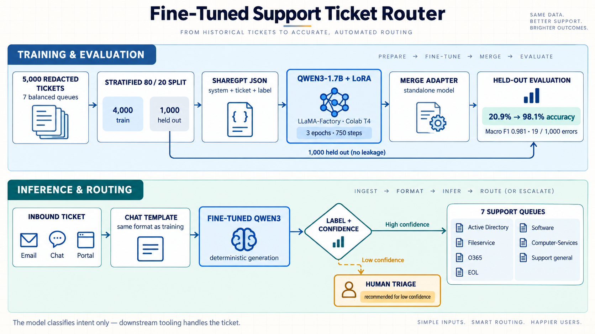

# LLaMA Board Reference Training Log

Reference run of the support-ticket router. Captured from the LLaMA Board UI
(Gradio share tunnel, since expired) and from the notebook's own cell outputs.

| | |
|---|---|
| **Run ID / Output dir** | `train_2026-09-11-17-48-28` |
| **Full path** | `/content/LLaMA-Factory/saves/Qwen3-1.7B-Base/lora/train_2026-09-11-17-48-28` |
| **Config file** | `2026-09-11-17-48-28.yaml` |
| **Base model** | `Qwen/Qwen3-1.7B-Base` |
| **Stage / method** | Supervised fine-tuning, LoRA |
| **Dataset** | `support_tickets` — 4,000 ShareGPT records in the training pool; internal split unresolved |
| **Device count** | 1 (Colab T4) |
| **DeepSpeed** | none |
| **Offload** | disabled |
| **Status** | `Finished.` |

## Architecture overview



The supplied diagram summarizes training and the intended routing workflow. Email/chat/portal ingestion, queue dispatch, and confidence-based human triage are proposed extensions, not implemented integrations. The 4,000 rows form a training pool; the internal validation setting and reconstructed three-epoch schedule are unresolved. “No leakage” means the held-out rows are excluded from TRAIN.json; semantic overlap has not been audited. Confidence is an uncalibrated first-token score, and the two reported accuracies use different decision rules.

## Evidence and configuration status

This file preserves the earlier run transcript. The original YAML, adapter configuration,
and complete trainer log are not included. “Defaults” below means the values reported by
the earlier write-up, not a verified configuration or the current UI defaults.

The notebook suggests an internal validation fraction of 0.1. Applied to the 4,000-row
training pool, that would leave about 3,600 optimization rows and 400 validation rows.
At effective batch size 16 for three epochs, this suggests approximately 675 steps,
whereas the saved plot reaches about 750. The latter fits all 4,000 rows. The internal
validation setting, actual optimization row count, and batch/epoch reconstruction remain
unresolved until the original YAML is recovered. The external 1,000-row evaluation
partition is excluded from TRAIN.json independently of this issue.

See the [project paper](project-paper.md) for corrected metric interpretation and the
[reproduction guide](reproducibility.md) for execution details.

## Hyperparameters

The following reconstruction is conditional on the training-row and batching assumptions above.
LoRA rank, alpha, target modules, dropout, training precision, cutoff, optimizer, and training
seed are not fully established by the retained evidence.

| Setting | Value | Derivation |
|---|---|---|
| Epochs | 3, inferred | 750 total steps ÷ 250 steps per epoch |
| Steps per epoch | 250, inferred | 4,000 training rows ÷ effective batch 16 |
| Effective batch size | 16, inferred | batch size 2 × gradient accumulation 8 (defaults) |
| Total optimiser steps | ~750 | x-axis of the loss curve |
| Learning rate | approximately 5e-5, inferred | LR at epoch 2.00 = 1.2591e-05; 5e-5 × ½(1 + cos(⅔π)) = 1.25e-05 |
| LR scheduler | consistent with cosine | observed decay follows a cosine, not a linear, curve |
| Logging interval | 5 steps | epoch advances 0.02 (= 5/250) per log line |
| Throughput | ~140 tokens/s | `'throughput': 140.49` |
| Step time | ~12 s | 5 logged steps per ~60 s of wall clock |

## Wall clock

| Marker | Time |
|---|---|
| Run started (from output dir name) | 17:48:28 |
| Epoch 1.72 | 19:32:12 |
| Epoch 2.00, checkpoint saved | 19:46:00 |

Roughly **12 s per optimiser step**, so the full 750-step / 3-epoch run takes on the
order of **2–3 hours** on the reported T4. This is an estimate from partial logs; an exact
finish timestamp is not retained. Persist artifacts before the Colab runtime recycles.

## Log excerpt (epochs 1.70 → 2.00)

Transcribed from the LLaMA Board log panel. `throughput` is truncated in the UI on
all but the first line.

```text
logging.py:144 >> {'loss': 0.0051, 'learning_rate': 1.9905e-05, 'epoch': 1.70, 'throughput': 140.49}
[INFO|2026-09-11 19:32:12] logging.py:144 >> {'loss': 0.0433, 'learning_rate': 1.9393e-05, 'epoch': 1.72, ...}
[INFO|2026-09-11 19:33:10] logging.py:144 >> {'loss': 0.0015, 'learning_rate': 1.8884e-05, 'epoch': 1.74, ...}
[INFO|2026-09-11 19:34:10] logging.py:144 >> {'loss': 0.0056, 'learning_rate': 1.8378e-05, 'epoch': 1.76, ...}
[INFO|2026-09-11 19:35:09] logging.py:144 >> {'loss': 0.0119, 'learning_rate': 1.7875e-05, 'epoch': 1.78, ...}
[INFO|2026-09-11 19:36:09] logging.py:144 >> {'loss': 0.0099, 'learning_rate': 1.7374e-05, 'epoch': 1.80, ...}
[INFO|2026-09-11 19:37:08] logging.py:144 >> {'loss': 0.0033, 'learning_rate': 1.6877e-05, 'epoch': 1.82, ...}
[INFO|2026-09-11 19:38:08] logging.py:144 >> {'loss': 0.0039, 'learning_rate': 1.6384e-05, 'epoch': 1.84, ...}
[INFO|2026-09-11 19:39:07] logging.py:144 >> {'loss': 0.0211, 'learning_rate': 1.5894e-05, 'epoch': 1.86, ...}
[INFO|2026-09-11 19:40:05] logging.py:144 >> {'loss': 0.0122, 'learning_rate': 1.5409e-05, 'epoch': 1.88, ...}
[INFO|2026-09-11 19:41:05] logging.py:144 >> {'loss': 0.0150, 'learning_rate': 1.4927e-05, 'epoch': 1.90, ...}
[INFO|2026-09-11 19:42:04] logging.py:144 >> {'loss': 0.0047, 'learning_rate': 1.4450e-05, 'epoch': 1.92, ...}
[INFO|2026-09-11 19:43:02] logging.py:144 >> {'loss': 0.0373, 'learning_rate': 1.3978e-05, 'epoch': 1.94, ...}
[INFO|2026-09-11 19:44:02] logging.py:144 >> {'loss': 0.0457, 'learning_rate': 1.3511e-05, 'epoch': 1.96, ...}
[INFO|2026-09-11 19:45:01] logging.py:144 >> {'loss': 0.0047, 'learning_rate': 1.3048e-05, 'epoch': 1.98, ...}
[INFO|2026-09-11 19:46:00] logging.py:144 >> {'loss': 0.0169, 'learning_rate': 1.2591e-05, 'epoch': 2.00, ...}
[INFO|2026-09-11 19:46:00] trainer.py:3815 >> Saving model checkpoint to saves/Qwen3-1.7B-Base/lora/train_2026-09-11-17-...
[INFO|2026-09-11 19:46:01] configuration_utils.py:780 >> loading configuration file config.json from cache at /root/.cac...
```

### How to read it

- Loss fluctuates in this window. Small training loss cannot establish convergence on unseen
  tickets, justify shorter training, or distinguish learning from memorization.
- Learning-rate values are consistent with cosine decay. They do not independently prove the
  original scheduler, warmup, or initial learning rate without the configuration.
- A checkpoint save at epoch 2.00 is recorded. This single event does not establish a general
  per-epoch saving policy or confirm the contents of a final adapter that is absent here.
- The notebook reports 98.1% held-out accuracy. This is a separate classification measurement,
  not an internal validation-loss result.

## Interpreting UI messages

A `Could not parse server response: SyntaxError: Unexpected token '<'` toast was reported in
the earlier notes. Do not assume every occurrence is harmless: check whether optimizer steps
continue and inspect backend logs. `Keyboard interruption` and tunnel-closing messages can
occur when the web UI cell is stopped manually after training. Confirm completion and saved
adapter files before treating shutdown as successful.

## Runtime artifacts described by the workflow

| Path | What it is |
|---|---|
| `saves/Qwen3-1.7B-Base/lora/train_2026-09-11-17-48-28/adapter_model.safetensors` | the trained LoRA weights |
| `.../adapter_config.json` | LoRA rank, alpha, target modules |
| `.../trainer_log.jsonl` | one JSON record per logged step — the notebook plots this |
| `.../2026-09-11-17-48-28.yaml` | config filename reported in earlier notes; file not retained in this repository |
| `/content/qwen3_merged/` | base + adapter merged into a standalone model (written by the notebook) |

The reference share URL is historical and should not be reused. Launching the web UI creates
a new tunnel. Closing the tunnel does not by itself remove files, but Colab runtime recycling
can remove local artifacts. None of the model weights or configuration files listed above is
included in this repository.
