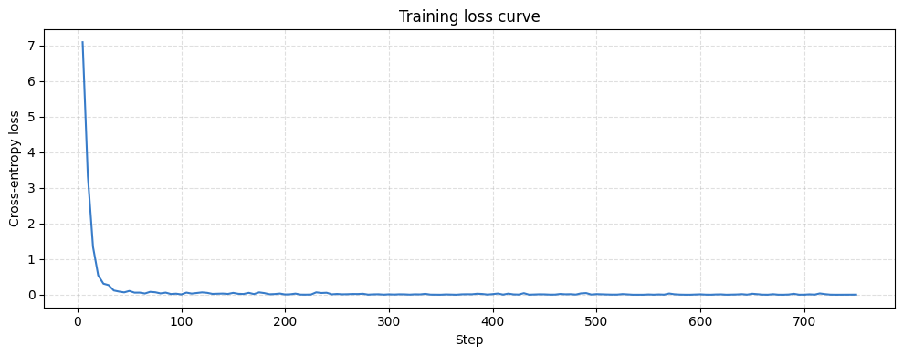
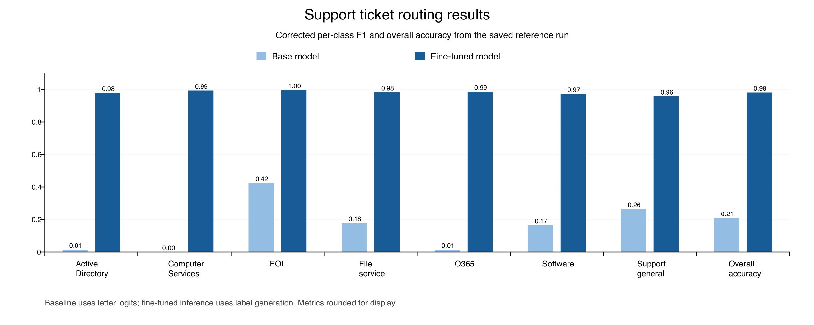
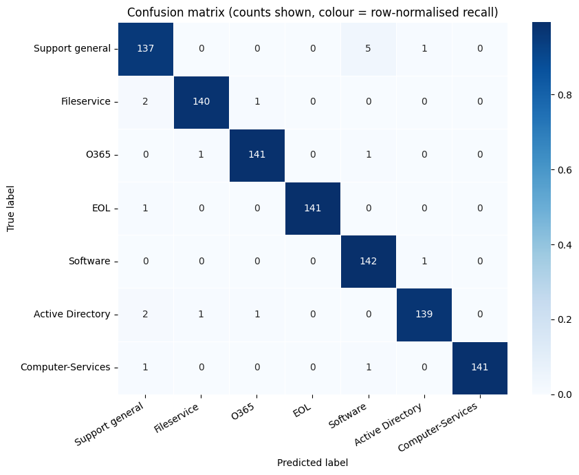

# Support Ticket Routing with Qwen3 and LoRA

Technical project paper based on the repository reference run of 11 September 2026

## Abstract

This project investigates supervised adaptation of a small causal language model for seven-class IT helpdesk routing. A dataset of 5,000 labeled tickets is divided into a 4,000-row training pool and a 1,000-row stratified held-out set. The workflow adapts `Qwen/Qwen3-1.7B-Base` using Low-Rank Adaptation (LoRA) through LLaMA-Factory, merges the adapter into the base model, and evaluates the resulting label-generation pipeline. Saved outputs report 981 correct predictions out of 1,000, or 98.1% accuracy, with macro F1 of 0.981. A constrained multiple-choice baseline scores 20.9% accuracy and macro F1 of 0.151. The observed difference is 77.2 percentage points, subject to a material difference in prompts and decoding methods. This paper documents the implementation and supporting evidence, corrects the interpretation of historical class labels, and identifies missing configuration, data provenance, and calibration evidence. The result supports further evaluation of the prototype; it does not establish production readiness.

**Keywords:** ticket classification, helpdesk routing, supervised fine-tuning, LoRA, Qwen3, parameter-efficient adaptation.

## 1 Problem statement and objectives

IT helpdesk routing maps a natural-language request to the team responsible for handling it. Requests can share vocabulary while requiring different queues: account access and shared-folder access, for example, need context beyond the word “access.” A router must select a consistent queue while making errors and ambiguous cases available for review.

The implemented task is single-label classification. Given ticket text x, the system returns one category y from seven labels. It does not generate customer responses, estimate urgency, resolve tickets, or dispatch webhooks. Those activities belong to a possible downstream service and are not implemented here.

The objectives are to build an end-to-end adaptation workflow, compare predictions with the unadapted base model, and examine per-class errors. The experiment asks whether this supervised pipeline improves routing on the supplied held-out dataset. It does not establish that a generative model is necessary or superior to all other classifiers.

| Label | Working queue description |
|---|---|
| Active Directory | User accounts, identity, login, and access workflows |
| Fileservice | Shared folders, file shares, and network drive permissions |
| O365 | Outlook, Teams, OneDrive, and collaboration services |
| EOL | Retirement and decommissioning of servers |
| Software | Application installation, updates, and access |
| Computer-Services | Printers, scanners, drivers, and device support |
| Support general | General requests needing triage |

These descriptions explain the intended taxonomy. A formal labeling policy, including boundaries between overlapping queues, is not available.

## 2 Technical background and design rationale

The selected checkpoint is `Qwen/Qwen3-1.7B-Base`. The notebook uses it as a causal language model whose output is a queue name. Its official model card supplies checkpoint identity and model details. See the [Qwen model card](https://huggingface.co/Qwen/Qwen3-1.7B-Base).

LoRA freezes pretrained weights and learns a low-rank update. For a weight matrix W of dimensions d by k, the conventional update is W_new = W + (alpha / r) BA. Here A has dimensions r by k, B has dimensions d by r, and r is the adapter rank. For each adapted matrix, r × (d + k) adapter entries are optimized instead of d × k base entries. The exact trainable-parameter count in this run cannot be calculated without its rank and target modules. See [Hu et al., LoRA](https://arxiv.org/abs/2106.09685).

LLaMA-Factory supplies dataset formatting and supervised training, while its LLaMA Board interface exposes training controls. The notebook registers ShareGPT-style message records using the conventions described in the [LLaMA-Factory data documentation](https://llamafactory.readthedocs.io/en/latest/getting_started/data_preparation.html).

A compact model may offer deployment flexibility, but the repository has no latency, memory, energy, or cost benchmark. TF-IDF classifiers, encoder classifiers, rules, and prompted instruction-tuned models are relevant comparisons that have not been evaluated.

## 3 Dataset and quality audit

### 3.1 Schema and observed properties

The supplied `support_tickets.csv` has columns `category_truth`, the reference class, and `text`, the ticket description. The notebook renames the first column to `label`, filters to seven recognized labels, shuffles, and splits the rows.

| Property | Repository audit result |
|---|---:|
| Rows | 5,000 |
| Classes | 7 |
| Empty or whitespace-only texts | 0 |
| Unique exact texts | 5,000 |
| Unique texts after lowercasing and collapsing whitespace | 5,000 |
| Mean length in characters | 175.7894 |
| Minimum length in characters | 72 |
| Maximum length in characters | 492 |

Texts include placeholders such as `[NAME]`, `[LOCATION]`, `[TICKET ID]`, `[SERVER]`, and `[USERNAME]`. These suggest some identifiers were replaced, but do not establish complete anonymization. The repository does not document the original source, collection dates, annotation process, annotator agreement, or whether texts were generated, rewritten, or collected from operational tickets. No dataset license is supplied.

Exact and simple normalized uniqueness do not establish semantic independence. Different phrasings of the same template or incident may occur across partitions. Source, user, incident, and timestamp fields are unavailable for a grouped or temporal split.

### 3.2 Class distribution and partitioning

The code first calls `sample(frac=1, random_state=42)`, then `train_test_split(test_size=0.2, stratify=df["label"], random_state=42)`. Both operations matter when reconstructing the same partition. The split counts are recorded in the notebook and agree with dataset totals and evaluation supports.

| Class | Full dataset | Training pool | Held-out evaluation |
|---|---:|---:|---:|
| Active Directory | 715 | 572 | 143 |
| Computer-Services | 714 | 571 | 143 |
| EOL | 714 | 572 | 142 |
| Fileservice | 714 | 571 | 143 |
| O365 | 714 | 571 | 143 |
| Software | 714 | 571 | 143 |
| Support general | 715 | 572 | 143 |
| Total | 5,000 | 4,000 | 1,000 |

The notebook names the held-out file `/content/val_split.csv`. This paper calls it the held-out evaluation set because it supplies the final scores. It is excluded from `TRAIN.json`. Since all full-dataset texts are unique, there can be no exact ticket-text overlap across this partition; semantic overlap remains unaudited.

Internal training validation is a separate issue. The notebook suggests `val_size=0.1` in LLaMA Board, which would divide the training pool into approximately 3,600 optimization examples and 400 validation examples. Historical step counts instead fit three epochs over all 4,000 examples at effective batch size 16. The original YAML is absent, so the actual internal validation setting is unresolved. The external 1,000-row partition is separate from this uncertainty.

## 4 Architecture and implementation

The notebook is the executable application. Its implemented data flow is:

```text
support_tickets.csv
  -> filter labels and shuffle with seed 42
  -> stratified split
       -> 4,000-row pool -> TRAIN.json -> LLaMA Board -> LoRA adapter
       -> 1,000 held-out rows -> val_split.csv

Base model + held-out tickets -> multiple-choice baseline predictions
Base model + LoRA adapter -> merged model -> generated queue predictions
Both prediction lists + reference labels -> reports and charts
```


Figure 1. Supplied architecture diagram. The supplied diagram summarizes training and the intended routing workflow. Email/chat/portal ingestion, queue dispatch, and confidence-based human triage are proposed extensions, not implemented integrations. The 4,000 rows form a training pool; the internal validation setting and reconstructed three-epoch schedule are unresolved. “No leakage” means the held-out rows are excluded from TRAIN.json; semantic overlap has not been audited. Confidence is an uncalibrated first-token score, and the two reported accuracies use different decision rules.

### 4.1 Training records and prompt

Each training record has a `messages` array with system, user, and assistant roles. The user content is `Support Ticket: ` followed by the text; the assistant content is the reference label. `dataset_info.json` registers these records as `support_tickets`, with ShareGPT formatting and explicit role/content tags.

The dataset-preparation and fine-tuned inference cells use this system instruction:

> You are an IT helpdesk ticket routing assistant. Given a support ticket, respond with exactly one of the following categories: Support general, Fileservice, O365, EOL, Software, Active Directory, Computer-Services.

This structure teaches label generation after reading a ticket. The exact training template and loss-masking settings must be recovered from the missing configuration; message structure alone does not establish them.

### 4.2 Adapter loading and merging

The notebook validates the adapter directory, loads the base model, and loads a tokenizer from the adapter directory when `tokenizer.json` exists there; otherwise it uses the base checkpoint. After baseline evaluation, it constructs the PEFT model, loads adapter weights, and calls `merge_and_unload()`. The merged model and tokenizer are saved to `/content/qwen3_merged`.

The inference stage selects CUDA, then Apple MPS, then CPU. It uses float16 on CUDA or MPS and float32 on CPU. These are inference settings, not evidence of the historical training precision. The full workflow still assumes Colab paths and its upload interface.

### 4.3 Classification and output handling

`classify(ticket_text, compute_confidence=True)` applies the tokenizer's chat template and generates at most 10 new tokens with `do_sample=False`. It decodes the continuation, strips whitespace, and finds the first label whose lowercase spelling is a prefix of the generated text. If none matches, it returns `Support general`.

Prefix matching accepts extra text after a valid label and does not enforce exact-output compliance. Unmatched generations are indistinguishable from ordinary Support general predictions in the saved evaluation. The function returns `(label, confidence)`; if confidence is disabled or generation scores are unavailable, the second value is the placeholder `1.0`.

### 4.4 Confidence calculation

The function takes the first token ID of each label, reads the first generation step's scores for those IDs, applies a softmax over those seven scores, and returns the value for the matched class. This is a restricted first-token preference, not the likelihood of the complete multi-token label or a calibrated probability of correctness.

Shared first tokens or differences between isolated-label tokenization and generation context can affect this score. The notebook does not test these properties, record calibration metrics, or implement a human-review threshold. Thresholds require separate validation with explicit fallback handling.

## 5 Experimental setup and training evidence

The reference directory is `/content/LLaMA-Factory/saves/Qwen3-1.7B-Base/lora/train_2026-09-11-17-48-28`. The repository retains notebook outputs and a transcribed log excerpt, but not the adapter, original YAML, or full trainer log. Observations and reconstructions therefore need different levels of confidence.

| Setting | Value or status | Evidence |
|---|---|---|
| Base checkpoint | Qwen/Qwen3-1.7B-Base | Source and saved path |
| Method | Supervised fine-tuning with LoRA | Workflow and adapter path |
| External split | 4,000 / 1,000 | Preparation output |
| Data shuffle and split seed | 42 | Source code |
| Device | One Colab T4, as reported | Run notes; inference output says CUDA |
| Optimizer steps | Approximately 750 | Saved training plot |
| Epochs | 3, inferred | Step and epoch reconstruction |
| Effective batch size | 16, inferred | 4,000 / 250 steps per epoch |
| Microbatch and accumulation | 2 × 8, reported defaults | Original configuration absent |
| Initial learning rate | Approximately 5e-5, inferred | Late-run rates under cosine decay |
| Scheduler | Cosine, inferred | Learning-rate decline |
| Internal validation fraction | Unresolved | Suggested 0.1 conflicts with step reconstruction |
| Rank, alpha, dropout, target modules | Unknown | Adapter configuration absent |
| Training precision, cutoff, optimizer, seed | Not fully recorded | Original YAML absent |

Saved installation output lists LLaMA-Factory `0.9.6.dev0`, Transformers `5.8.0`, PEFT `0.18.1`, Accelerate `1.11.0`, Datasets `4.0.0`, TRL `0.24.0`, Gradio `5.50.0`, and Tokenizers `0.22.2`. This is a partial historical record, not a tested dependency lock. Installation clones LLaMA-Factory without pinning a commit, so future executions can resolve different versions.

### 5.1 Training behavior



Figure 2. Historical loss curve. The starting logged loss is 7.0881 and the final logged loss is 0.0028; the plot extends to approximately 750 optimizer steps.

Loss drops sharply early in training. Learning a small set of output strings is one possible contributor, but the curve cannot separate format learning, routing skill, memorization, or effects of loss masking. The final point is a logged training loss, not a held-out error rate or internal validation loss.

The transcribed log spans epoch 1.72 at 19:32:12 to epoch 2.00 at 19:46:00 and includes throughput of about 140 tokens per second. The directory name supplies a nominal start of 17:48:28. Partial observations suggest a training budget of roughly two to three hours; an exact finish timestamp and peak GPU memory are absent. Equivalent accuracy after fewer epochs has not been demonstrated.

## 6 Evaluation methodology

### 6.1 Base model decision rule

Before attaching the adapter, `classify_base()` assigns labels to letters: A = Support general, B = Fileservice, C = O365, D = EOL, E = Software, F = Active Directory, and G = Computer-Services. The prompt asks for one letter. A single forward pass supplies next-token logits, and the highest-scoring candidate determines the class.

For each letter, the code prefers its spaced encoding if that is one token; otherwise it takes the first token of the unspaced encoding without asserting that it is a single token. Predictions are valid categories by construction. This is one prompt and fixed option order, not a search for the strongest possible base-model baseline.

### 6.2 Fine-tuned decision rule and comparability

The fine-tuned model uses the category-list instruction and greedy generation in Section 4. Both pipelines use the same held-out rows, but different prompt wording, output vocabulary, and decoding. The comparison measures those complete pipelines. A controlled experiment would use identical candidate-label scoring, prompt content, and tokenizer/template treatment for both checkpoints, and measure unconstrained generation compliance separately.

### 6.3 Metrics

Accuracy is the number of correct predictions divided by 1,000. For each class, precision is TP / (TP + FP), recall is TP / (TP + FN), and F1 is 2PR / (P + R). Macro F1 averages classes equally; weighted F1 weights them by support. The nearly balanced classes make these averages similar here. Uniform random guessing has expected accuracy 1/7, approximately 14.3%; this is an analytical reference, not an executed baseline.

Reports specify matching `labels` and `target_names` sequences. The confusion matrix uses true classes as rows and predictions as columns. Printed entries are counts; color is normalized within each row. Report metrics are rounded to three decimals, and accuracies to one decimal percent.

Only one recorded run and one external split are available. There are no repeated-seed results, calibration study, external-domain test, or complete per-ticket prediction export.

## 7 Results and metric provenance

### 7.1 Aggregate results

| Metric | Base model | Fine-tuned model | Difference |
|---|---:|---:|---:|
| Accuracy | 20.9% | 98.1% | +77.2 percentage points |
| Correct predictions | 209 | 981 | +772 |
| Errors | 791 | 19 | 772 fewer |
| Macro F1 | 0.151 | 0.981 | +0.830 |
| Active Directory recall | 0.7% | 97.2% | +96.5 percentage points |



Figure 3. Corrected class mapping. Baseline F1 values come from the remapped historical report, rounded to three decimals; fine-tuned F1 values are recomputed from the saved matrix counts. No model inference was rerun to produce this chart.

### 7.2 Fine-tuned results by class

| Class | Precision | Recall | F1 | Support |
|---|---:|---:|---:|---:|
| Active Directory | 0.986 | 0.972 | 0.979 | 143 |
| Computer-Services | 1.000 | 0.986 | 0.993 | 143 |
| EOL | 1.000 | 0.993 | 0.996 | 142 |
| Fileservice | 0.986 | 0.979 | 0.982 | 143 |
| O365 | 0.986 | 0.986 | 0.986 | 143 |
| Software | 0.953 | 0.993 | 0.973 | 143 |
| Support general | 0.958 | 0.958 | 0.958 | 143 |

Support general has the lowest recall at 137/143. Software has the lowest precision at 142/149. Active Directory has four false negatives among 143 reference examples. These identify queues to inspect, but cannot establish business severity because urgency and handling cost are not annotated.

### 7.3 Baseline results by class

| Class | Precision | Recall | F1 | Support |
|---|---:|---:|---:|---:|
| Active Directory | 1.000 | 0.007 | 0.014 | 143 |
| Computer-Services | 0.000 | 0.000 | 0.000 | 143 |
| EOL | 0.929 | 0.275 | 0.424 | 142 |
| Fileservice | 1.000 | 0.098 | 0.178 | 143 |
| O365 | 0.333 | 0.007 | 0.014 | 143 |
| Software | 0.867 | 0.091 | 0.165 | 143 |
| Support general | 0.152 | 0.986 | 0.264 | 143 |

High Support general recall and low precision imply that roughly 925 of 1,000 baseline predictions went to the first option. This is consistent with option-position bias or a prompt-induced default, but one option order cannot establish the cause. Permuting answer order would test that explanation. Aggregate metrics cannot determine whether errors arise from language understanding, taxonomy ambiguity, or formatting.

### 7.4 Historical class-name ordering defect

Originally, `classification_report` received `target_names=LABEL_TOKENS` without an explicit `labels` sequence. The inferred class order was alphabetical, while display names followed the custom project order. Per-class values were therefore attached to incorrect names. The affected calls were the baseline report, fine-tuned report, and comparison-chart helper. The confusion matrix already specified `labels=LABEL_TOKENS`. See the [scikit-learn parameter documentation](https://scikit-learn.org/stable/modules/generated/sklearn.metrics.classification_report.html).

Current notebook source fixes all three calls; historical outputs predate the fix. This paper remaps baseline rows to their true alphabetical class names and recomputes fine-tuned metrics from the matrix. Accuracy and aggregate F1 were unaffected. The corrected standalone documentation chart replaces the stale chart; the embedded historical notebook chart remains unchanged.

The [reference results](reference-results.json) preserve the transcribed matrix, remapped baseline report, and data audit. They are derived aggregate evidence, not a new experiment or a replacement for per-ticket predictions.

## 8 Error analysis and discussion



Figure 4. Saved matrix with correct class ordering. The diagonal sums to 981; off-diagonal entries sum to 19.

| True class | Correct | Misrouted predictions |
|---|---:|---|
| Support general | 137 / 143 | 5 Software; 1 Active Directory |
| Fileservice | 140 / 143 | 2 Support general; 1 O365 |
| O365 | 141 / 143 | 1 Fileservice; 1 Software |
| EOL | 141 / 142 | 1 Support general |
| Software | 142 / 143 | 1 Active Directory |
| Active Directory | 139 / 143 | 2 Support general; 1 Fileservice; 1 O365 |
| Computer-Services | 141 / 143 | 1 Support general; 1 Software |

Support general to Software is the largest off-diagonal entry, accounting for five of 19 errors. Counts alone cannot establish whether these are ambiguous, mislabeled, or clearly misclassified tickets. Claims about label noise or absence of systematic confusion require ticket-level review. An error export should retain identifiers, reference labels, raw generations, parsed labels, fallback flags, and confidence values.

The five hand-written smoke tests yield four correct predictions. “Please create a new user account for the new employee starting Monday.” is routed to Support general instead of Active Directory, with confidence of 61.1%. The other four scores range from 98.7% to 100.0%. This demonstrates a failure on a plausible request despite high benchmark accuracy. It does not establish calibration, explain the error, or validate a threshold.

The useful finding is strong classification on this partition. Transfer to new organizations, writing styles, or queue definitions remains unmeasured. An incorrect general-queue prediction cannot automatically be assumed harmless, and perfect observed precision on a small sample does not guarantee future precision.

## 9 Limitations and threats to validity

**Comparison design.** Different prompts and decision rules prevent attribution of the entire improvement to LoRA updates. Fixed option order may disadvantage the baseline. Alternative classifiers and instruction-model baselines were not evaluated.

**Data provenance and independence.** Exact uniqueness is verified, but source authenticity, label quality, semantic overlap, and operational representativeness are unknown. Balanced single-label data does not test realistic class imbalance, multi-intent requests, or new categories.

**Repeatability.** Missing training YAML, adapter configuration, model revision, full logs, and dependency lock prevent exact recreation. Internal validation is unresolved. Data split seed 42 is not evidence that all training randomness was fixed.

**Output handling.** Prefix matching accepts some noncompliant generations, fallback conceals format failures, and first-token confidence lacks calibration. Invalid-output rate, review coverage, and accuracy after abstaining are not measured.

**Measurement scope.** One saved run does not establish variability across seeds, external generalization, optimal training duration, or early-stopping behavior. Low training loss cannot establish these properties.

**Operational scope.** There is no serving endpoint, ticket-system integration, concurrency test, latency benchmark, measured cost, or monitoring implementation. Placeholder tokens do not prove complete anonymization. Deployment requires a separately evaluated design.

## 10 Reproducibility and future work

The [reproduction guide](reproducibility.md) provides execution order and expected artifacts. First, preserve the complete training configuration and partition manifests, then score both checkpoints using a matched protocol. Option-order permutations and simpler classifiers would clarify the comparison.

Next, audit semantic duplicates and review every error against an explicit labeling policy. Keep calibration data separate from final evaluation, record invalid generations, and choose human-review thresholds by measuring automated coverage against routing error. Repeat training across seeds and evaluate early checkpoints before claiming fewer epochs are adequate.

Operational evaluation should use appropriately handled representative tickets, including difficult, multi-intent, and unfamiliar cases. Measure per-queue precision and recall alongside latency, resource use, fallback frequency, and review volume. Dispatch and monitoring are separate extensions requiring observable failure handling.

## 11 Conclusion

The repository demonstrates a complete notebook workflow for LoRA adaptation, merging, and seven-class routing. The saved fine-tuned pipeline correctly classifies 981 of 1,000 held-out rows, compared with 209 for the implemented baseline. Correcting historical class names makes the per-class evidence consistent with the confusion matrix. A reproducible configuration, matched comparison, data-independence audit, and operational evaluation are needed to establish how much of this gain transfers beyond the supplied dataset.

## References

1. Hu, E. J., et al. (2021). [LoRA: Low-Rank Adaptation of Large Language Models](https://arxiv.org/abs/2106.09685). Background for low-rank updates.
2. Qwen. [Qwen3 1.7B Base model card](https://huggingface.co/Qwen/Qwen3-1.7B-Base). Source checkpoint documentation.
3. LLaMA-Factory. [Data Preparation](https://llamafactory.readthedocs.io/en/latest/getting_started/data_preparation.html). Registration and message formats.
4. scikit-learn. [Classification report API](https://scikit-learn.org/stable/modules/generated/sklearn.metrics.classification_report.html). Label order and metrics.
5. Repository sources. [Notebook](../Finetune_Support_Ticket_Classifier_Qwen3.ipynb), [dataset](../support_tickets.csv), [training log](llama-board-training-log.md), and [aggregate evidence](reference-results.json). Implementation and experiment results.

External references were consulted on 11 September 2026. They explain methods and APIs; the experiment's numerical results come from repository evidence.
